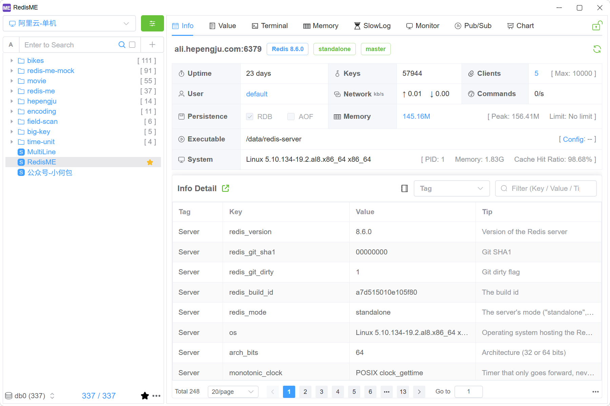
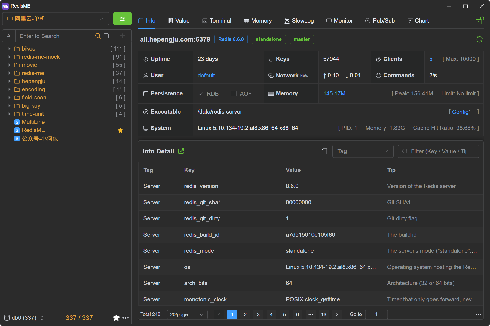

<div align="center">

# RedisME

### A modern, lightweight, cross-platform Redis desktop manager

English | <a href="/README_zh.md">简体中文</a> | <a href="/docs/en/guide/intro/screenshots.md">Screenshots</a>

[](https://github.com/hepengju/redis-me/blob/main/LICENSE)
[](https://github.com/hepengju/redis-me/releases)
[](https://github.com/hepengju/redis-me/releases)

</div>





## Features

- Super Lightweight: Based on Webview, no embedded browser (Thanks to [Tauri](https://tauri.app))
- Pretty UI: Provides light/dark themes (Thanks to [ElementPlus](https://element-plus.org), [CodeMirror](https://codemirror.net/), [VueWebTerminal](https://tzfun.github.io/vue-web-terminal/))
- Cross-platform: Supports Windows/Mac/Linux
- Multi-language: English, Chinese, more languages coming soon
- Rich functionality: info, value, terminal, memory analysis, slow logs, command monitoring, pub/sub etc

## Special Features

- Dynamic switching between read-only/writable modes
- Terminal command prompts and detailed explanations
- Highlighting and detailed explanations of info fields
- Configuration field comparison, detailed explanations, and default value references
- Fine-grained memory scan parameter configuration for quick memory issue troubleshooting
- Terminal command execution with automatic broadcasting to multiple nodes in a cluster
- Cluster operations can specify nodes

## Installation

Available to download for free from [here](https://github.com/hepengju/redis-me/releases)

## Build Guidelines

```shell
# System Prerequisites: Refer Tauri  https://tauri.app/start/prerequisites/
# Windows: Microsoft C++
# Mac: Xcode
# Linux: libwebkit2gtk, build-essential etc

# rust
curl --proto '=https' --tlsv1.2 -sSf https://sh.rustup.rs | sh

# vite+: node/pnpm etc
curl -fsSL https://vite.plus | bash

# clone
git clone https://github.com/hepengju/redis-me.git

# install package.json and start dev
vp install
vp run tauri dev
```

## WeChat Official Account

Regularly shares RedisME special features and update logs, as well as other technical issues and solutions.


