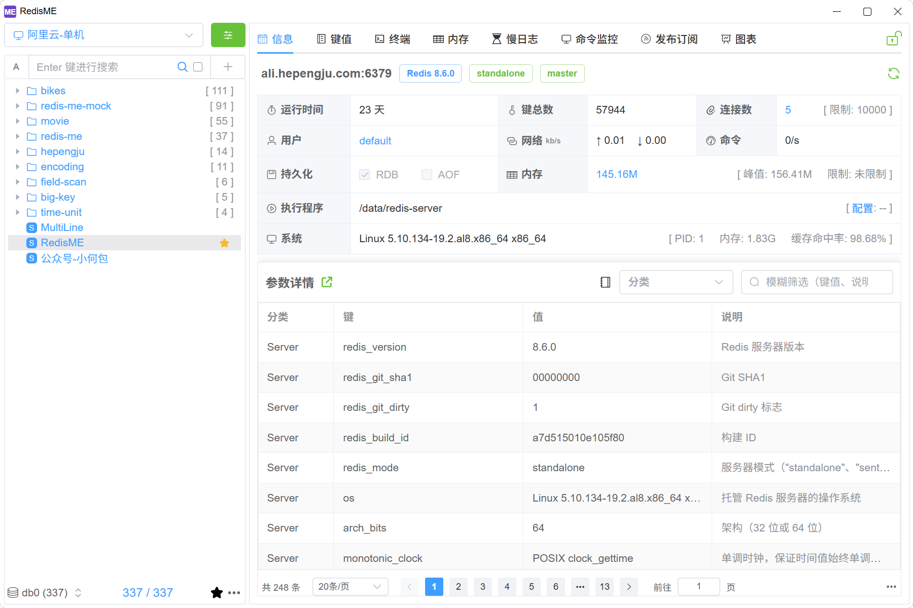
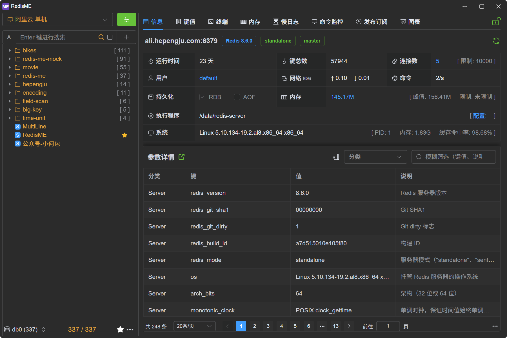

<div align="center">

# RedisME

### 一个现代、轻量、跨平台的 Redis 桌面客户端

<a href="/README.md">English</a> | 简体中文 | <a href="/docs/zh/guide/intro/screenshots.md">更多截图</a>

[](https://github.com/hepengju/redis-me/blob/main/LICENSE)
[](https://github.com/hepengju/redis-me/releases)
[](https://github.com/hepengju/redis-me/releases)

</div>





## 功能

- 极度轻量：基于 Webview，无内嵌浏览器，安装包小于 10M（感谢 [Tauri](https://tauri.app/zh-cn)）
- 界面美观：提供浅色/深色主题（感谢 [ElementPlus](https://cn.element-plus.org/zh-CN/), [CodeMirror](https://codemirror.net/), [VueWebTerminal](https://tzfun.github.io/vue-web-terminal/zh/)）
- 跨平台支持：支持 Windows/Mac/Linux
- 多语言支持：英文、中文，敬请期待其他语言
- 功能丰富：支持信息、键值、终端、内存分析、慢日志、命令监控、发布订阅等

## 特色功能

- 只读/可写模式动态切换
- 终端命令提示及详细解释
- Info 字段高亮与详细解释
- 配置字段的差异比对、详细解释、默认值参考
- 精细化的内存扫描参数配置，快速排查内存问题
- 终端执行命令，支持自动广播到集群的多节点
- 集群操作可指定节点

## 应用安装

提供 Mac、Windows 和 Linux 安装包，可免费下载 [Github](https://github.com/hepengju/redis-me/releases)、[Gitee](https://gitee.com/hepengju/redis-me/releases)

## 构建项目

```shell
# 系统前置依赖: Tauri说明 https://tauri.app/zh-cn/start/prerequisites/#rust
# Windows: Microsoft C++
# Mac: Xcode
# Linux: libwebkit2gtk, build-essential 等

# 安装 Rust （国内镜像 https://rsproxy.cn/）
curl --proto '=https' --tlsv1.2 -sSf https://sh.rustup.rs | sh

# 安装vite+: 自动管理node/pnpm （国内镜像 https://npmmirror.com, 环境变量: NPM_CONFIG_REGISTRY）
curl -fsSL https://vite.plus | bash

# 克隆项目
git clone https://github.com/hepengju/redis-me.git

# 安装前端依赖，然后本地启动开发模式
vp install
vp run tauri dev
```

## 微信公众号

定期分享 RedisME 的特色功能与图文更新日志，及其他技术疑难问题和解决方案


