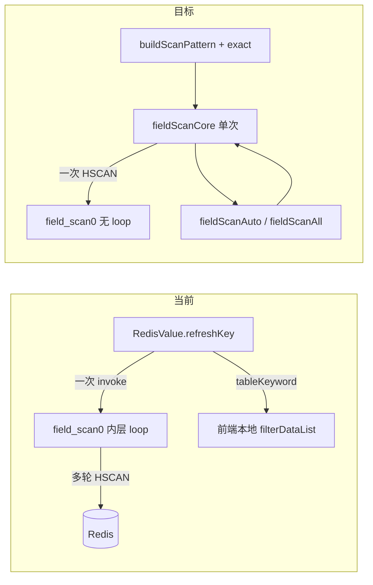

# Hash/Set/ZSet 字段扫描改造方案

> **实现状态**：待实现  
> **关联 backlog**：[docs/zh/changelog/future.md](../docs/zh/changelog/future.md) 第 4 行「Hash/Set/ZSet的扫描模式支持」  
> **参考实现**：键扫描 [06_scan-keys-optimization.md](./06_scan-keys-optimization.md)、[KeyMain.vue](../src/views/KeyMain.vue)

## 背景

Hash / Set / ZSet 等集合类型的字段扫描目前：

- **无 pattern / 精确查询**：表格上方 `tableKeyword` 仅在前端做本地模糊筛选，不会传给 Redis HSCAN/SSCAN/ZSCAN。
- **循环在后端**：`field_scan0` 内层 `loop` 多轮扫描，直到凑够 `count` 或 `load_all` 扫完；与键扫描（前端 `scanKeyCore` / `scanKeyAuto` 驱动）不一致。

目标：改为与键扫描相同的形式——**pattern 输入 + 是否精确查询 + 前端控制循环**。

## 已确认范围

| 项                   | 结论                                                                                                     |
| -------------------- | -------------------------------------------------------------------------------------------------------- |
| Hash pattern / exact | **仅匹配 field 名**（Redis HSCAN 语义），不匹配 value                                                    |
| **输入框规则**       | **与键扫描完全一致**（见下节 `buildScanPattern`）；勾选 exact 后走 HGET / SISMEMBER / ZSCORE，不走 HSCAN |
| List / Stream        | 纳入**前端循环**改造；Stream 范围用 **minId/maxId**；List/Stream 表格仍用**本地模糊筛选**                |
| `load_all` 字段      | **删除**；「加载全部」改由前端 `fieldScanAll` 循环驱动                                                   |
| **顶栏 hashKey**     | **删除**（Hash/Stream 顶栏子键/ID 输入及 `withHashKey` 单条模式）；见下节                                |

---

## 输入框与 pattern 规则（与键扫描一致）

**复用** [redis-glob.ts](../src/utils/redis-glob.ts) 的 `buildScanPattern(keyword, exact)`，**不传** `loadFolder`（字段扫描无目录模式）。

与 [KeyMain.vue](../src/views/KeyMain.vue) 相同的前端计算：

```typescript
const fieldMatch = computed(() => buildScanPattern(fieldKeyword.value, fieldExact.value))
// invoke 时：match: fieldMatch.value，exact: fieldExact.value
```

### 未勾选「完全匹配」（走 HSCAN / SSCAN / ZSCAN + MATCH）

| 用户输入 | 传给后端的 pattern | 含义                                         |
| -------- | ------------------ | -------------------------------------------- |
| （空）   | `*`                | 全量扫描                                     |
| `app`    | `*app*`            | 包含 app                                     |
| `app*`   | `app*`             | 以 app 开头                                  |
| `*app`   | `*app`             | 以 app 结尾                                  |
| `app?x`  | `app?x`            | 含 `*` / `?` / `[` 时**原样**作为 Redis glob |

后端：`exact=false`，`field_scan_1_cmd` 带 `MATCH pattern`（pattern 为 `*` 时可省略 MATCH，与键扫描一致）。

### 勾选「完全匹配」（不走 SCAN，走单条命令）

| 类型 | 后端命令               | 说明                                                      |
| ---- | ---------------------- | --------------------------------------------------------- |
| Hash | `HGET key field`       | 输入为**完整 field 名**（含 `*` 也按字面量，不展开 glob） |
| Set  | `SISMEMBER key member` | 输入为**完整 member**                                     |
| ZSet | `ZSCORE key member`    | 输入为**完整 member**；命中则返回 `{value, score}`        |

- `exact=true` 时：**不**进入 HSCAN/SSCAN/ZSCAN；一次 invoke 返回 0/1 条，`cursor.finished=true`。
- 未命中：空列表，finished=true（与键扫描 `EXISTS` 未命中一致）。

### 触发方式（对齐键扫描）

- **Enter** 或 suffix **搜索图标** → 从头 scan（`cursor=null`，`fieldScanAuto` 凑满一页阈值）。
- **切换 exact 勾选**：与键扫描相同——**不立即重新 scan**，仅更新本地展示过滤（见已确认决策 #1）；按 Enter / 点搜索才重新请求后端。
- 扫描进行中：输入框 `readonly`（与键扫描 `loading` 时一致）。

### tooltip 文案

与 `keyMain.exactSearch` 结构相同，对象改为 field / member（Hash 注明只匹配 field 名）。可新增 `redisValue.fieldExactSearch`，或参数化复用。

---

## 现状 vs 目标



| 维度        | 键扫描（已实现）                                  | 字段扫描（当前）                 | 字段扫描（目标）                                        |
| ----------- | ------------------------------------------------- | -------------------------------- | ------------------------------------------------------- |
| Pattern     | `buildScanPattern` + `exact` → `ScanParam`        | 无；`tableKeyword` 仅本地 filter | Hash/Set/ZSet：`match` + `exact` 传后端 MATCH           |
| 循环        | 前端 `scanKeyCore` / `scanKeyAuto` / `scanKeyAll` | 后端 `field_scan0` 内 `loop`     | 前端 `fieldScanCore` / `fieldScanAuto` / `fieldScanAll` |
| 精确查询    | `EXISTS` 一次返回                                 | 无                               | Hash:`HGET` / Set:`SISMEMBER` / ZSet:`ZSCORE`           |
| List/Stream | 不适用                                            | 后端 `load_all` 一次拉完         | 前端循环；不加 pattern/exact                            |

---

## 关于 `load_all`：建议直接删除

当前 `FieldScanParam.load_all` 仅被以下位置使用：

| 文件                                                                                         | 用途                                                                |
| -------------------------------------------------------------------------------------------- | ------------------------------------------------------------------- |
| [client_trait.rs](../src-tauri/src/client/client_trait.rs)                                   | Hash/Set/ZSet 内层 loop 扫到完；List LRANGE `-1`；Stream 不传 COUNT |
| [RedisValue.vue](../src/views/tab/RedisValue.vue)                                            | 「加载剩余所有」按钮传 `loadAll: true`                              |
| [RedisTauri.vue](../src/views/tab/RedisTauri.vue) / [mod.rs](../src-tauri/src/client/mod.rs) | mock / 测试默认值                                                   |
| [tauri-specta.ts](../src/types/tauri-specta.ts)                                              | 类型定义                                                            |

**无其他调用方**。前端改为 `fieldScanAll()` 递归 invoke 后，后端不再需要该字段。

改造约定：

- 从 `FieldScanParam` **移除** `load_all`。
- 前端 `refreshKey(..., loadAll)` 的第三参可保留为**纯前端语义**（是否循环到 `cursor.finished`），但 **不再写入 invoke 参数**。
- `buildFieldScanParam` 不再传 `loadAll` 字段。

---

## 一、后端改造（Rust / Tauri）

### 1. 扩展并精简 `FieldScanParam` — [model.rs](../src-tauri/src/utils/model.rs)

**新增**（与 `ScanParam` 对齐）：

```rust
/// HSCAN/SSCAN/ZSCAN 的 MATCH pattern（前端 serde 字段名 match，与 ScanParam 一致）
#[serde(rename = "match")]
pattern: String,
/// 完全匹配：true 时走 HGET / SISMEMBER / ZSCORE，false 时走 *SCAN + MATCH
exact: bool,
```

前端 invoke 与键扫描对齐：`match: fieldMatch.value`，`exact: fieldExact.value`。

**删除**：

```rust
load_all: bool,   // 由前端 fieldScanAll 循环替代
hash_key: Option<String>,  // 顶栏单 field / Stream ID；改由 exact 与 meta.min_id/max_id 替代
```

`field_scan_0_get` 中依赖 `hash_key` 的分支一并删除：

- Hash：`HGET` 单 field → 改由 `exact=true` + `field_scan_0_exact`
- Stream：`XRANGE id id` 单 entry → 改由 **minId=maxId=目标 ID**（表格 meta）或本地 `tableKeyword` 筛 id

`field_scan0` / `field_scan_4_return` 中的 `with_field_key` 逻辑可随之简化（field_scan 路径恒为 false）。

Specta 重生成后同步 [tauri-specta.ts](../src/types/tauri-specta.ts)。

### 2. 单次扫描 + 精确路径 — [client_trait.rs](../src-tauri/src/client/client_trait.rs)

**新增 `field_scan_0_exact`**（类比 `scan_0_exact`，**仅在 `exact=true` 时调用**）：

| 类型 | exact 实现                                           | 返回                     |
| ---- | ---------------------------------------------------- | ------------------------ |
| Hash | `HGET key field`（不存在则空列表；有 HTTL 则补 ttl） | 单条 `{key,value[,ttl]}` |
| Set  | `SISMEMBER` → 存在则取 member 本身组装一行           | 0/1 条 member            |
| ZSet | `ZSCORE` → 存在则 `{value, score}`                   | 0/1 条                   |

- `cursor.finished = true`；`length` 仍走 `resolve_field_scan_length`（键内总条数，非当前结果数）。

**改造 `field_scan_1_cmd`**：

```rust
// 现状：HSCAN key cursor COUNT n
// 目标：HSCAN key cursor [MATCH pattern] COUNT batch_count
```

- `exact=true` 时走 exact 路径，不进入 scan。
- pattern 为空/`*` 时可省略 MATCH（与键扫描一致）。
- COUNT 可复用 `scan_0_batch_count(pattern)`；**前端累积阈值**仍用 settings `fieldScanCount`。

**改造 `field_scan0`**：

- Hash/Set/ZSet：**删除**内层 `loop`（约 L215–247），每次 API 只执行**一轮** HSCAN/SSCAN/ZSCAN。
- 入口先调 `field_scan_0_exact`，有结果则直接返回。
- List：去掉 `load_all` 分支；每次 LRANGE 只取 `count` 条，cursor 为起始下标。
- Stream：去掉 `load_all` 时不传 COUNT 的全量 XREVRANGE；每次固定 COUNT。

**无需改动的委托层**：[impl_single.rs](../src-tauri/src/client/impl_single.rs)、[impl_cluster.rs](../src-tauri/src/client/impl_cluster.rs)、[api.rs](../src-tauri/src/api.rs)（命令名 `field_scan` 不变）。

### 3. 测试 — [mod.rs](../src-tauri/src/client/mod.rs)

- `test_field_scan_param`：补 `match` / `exact`，去掉 `load_all`、`hash_key`。
- 新增：带 MATCH 的 hash 分页（两次 invoke cursor 递增）、exact 命中/未命中、List/Stream 单页 + cursor 续扫。

---

## 二、前端改造（Vue / TS）

### 1. 核心文件 — [RedisValue.vue](../src/views/tab/RedisValue.vue)

**状态**（参考 [KeyMain.vue](../src/views/KeyMain.vue)）

| 新增/调整                                    | 说明                                                              |
| -------------------------------------------- | ----------------------------------------------------------------- |
| `fieldKeyword` / `fieldExact` / `fieldMatch` | Hash/Set/ZSet 服务端搜索（UI 对齐 KeyMain）                       |
| `filterFieldPattern` / `filterFieldList`     | 切换 exact 未 Enter 时本地 minimatch                              |
| `fieldScanPaused` / 进度环等                 | 与 KeyMain 一致                                                   |
| `tableKeyword`                               | **List/Stream** 本地模糊筛选（Stream 可筛 entry id）              |
| ~~`hashKey` / `withHashKey`~~                | **删除**                                                          |
| ~~`stringTypeOrWithHashKey`~~                | **删除**；`stringTypeOrWithHashKey` 相关分支还原为仅 `stringType` |

**扫描函数**（对齐键扫描命名）：

```typescript
async function fieldScanCore(useCursor = false): Promise<number>
async function fieldScanAuto(fetchedCount = 0): Promise<void> // 累积至 fieldScanCount 停止
async function fieldScanAll(): Promise<void> // 直到 cursor.finished
async function refreshFieldScan(useCursor, loadAll, reset): Promise<void>
```

- `buildFieldScanParam`：增加 `match`、`exact`；**不再传 `loadAll` / `hashKey`**。
- `resetParam`：去掉 `hashKey` / `withHashKey` 清理。
- **删除顶栏** `value-header-hash` 输入框（`v-if="hashType || streamType"` 整块）。
- 底部 segmented（json/table）条件中去掉 `withHashKey` 判断。

**表格数据**

- Hash/Set/ZSet：`dataList` 直接来自 `redisValue`，**移除** `filterDataList` 对这三类的 keyword 过滤。
- List/Stream：保留 `tableKeyword` + `filterDataList`。

**UI**（表格视图工具栏，约 L1231–1254）

- Hash/Set/ZSet：**输入框交互对齐 KeyMain 键搜索框**（suffix：进度环 + 暂停/继续 + 搜索图标 + exact checkbox）；placeholder 参考 `keyMain.keyword`。
- 进度环逻辑对齐 [KeyMain.vue](../src/views/KeyMain.vue)：`scanProgress` 可按 `redisValue.length`（HLEN/SCARD/ZCARD）估算；`showScanControl` / `onScanAction` / `scanPaused` 同名语义。
- Enter / 搜索图标 → 从头 scan。
- List/Stream：仍为「模糊筛选」，不显示 exact checkbox。

**其他调用点**（保存/删字段后的 `refreshKey(false)`）：无 keyword 时 match=`*`；**有 keyword 时保留 keyword 并带同一 match 重新 scan**。

### 2. 工具复用 — [redis-glob.ts](../src/utils/redis-glob.ts)

- 复用 `buildScanPattern` / `isRedisGlob`；无需 `loadFolder`。

### 3. 类型与 mock

- [tauri-specta.ts](../src/types/tauri-specta.ts)：Specta 重生成。
- [RedisTauri.vue](../src/views/tab/RedisTauri.vue)：`minimalFieldScan` 去掉 `loadAll` / `hashKey`，补 `match` / `exact`。

### 4. i18n — [zh-cn.ts](../src/locales/lang/zh-cn.ts) / [en.ts](../src/locales/lang/en.ts)

- 拆分或调整 `tableKeyword` → `fieldScanPlaceholder`、`fieldExactSearch`。
- 复用或镜像 `keyMain.scanning` / `pauseScan` / `resumeScan`（字段扫描上下文）。
- [Setting.vue](../src/views/ext/Setting.vue)：`fieldScanCountTip` 改为「每轮扫描累积条数阈值（前端控制循环）」。

---

## 三、行为说明与边界

| 场景                                    | 行为                                                                |
| --------------------------------------- | ------------------------------------------------------------------- |
| 打开 Hash 键、无 keyword                | match=`*`，扫一页（fieldScanCount 条）→ 「加载更多」                |
| 输入 `app` + Enter                      | match=`*app*`，前端 auto 循环直到凑满 fieldScanCount 或 finished    |
| 输入 `app*` + Enter                     | match=`app*`，只匹配以 app 开头的 field/member                      |
| 勾选 exact + `field1` + Enter           | 后端 HGET（或 SISMEMBER/ZSCORE），0/1 条，finished=true             |
| 有 keyword 时点「加载更多/全部」        | **沿用当前 match + exact**，cursor 续扫                             |
| 切换键 / reset（`KEY_REFRESH`、选新键） | 清空 fieldKeyword、fieldExact、cursor、列表                         |
| Hash 查单 field                         | 表格 **exact + field 名** → HGET，双击/FieldSet 编辑                |
| Stream 查单 entry                       | **minId = maxId = 目标 ID** 后 refresh；或 `tableKeyword` 本地筛 id |
| List 加载全部                           | 前端 `fieldScanAll` 多次 LRANGE                                     |
| Stream 加载全部                         | 前端循环 XREVRANGE + cursor                                         |
| 集群模式                                | 与现 field_scan 相同；HSCAN MATCH 行为一致                          |

**刻意不做（本次）**

- Hash **value** 维度搜索（留给 future「Hash仅查询键」等）。
- Stream entry 的 **exact 模式**（按 ID 精确查仍用 minId/maxId 或本地筛选，不新增 Stream exact API）。
- 键扫描的**搜索历史**。

---

## 四、已确认决策

| #   | 结论                                                                                                   |
| --- | ------------------------------------------------------------------------------------------------------ |
| 1   | 切换 exact 未 Enter：**加** `filterFieldList` + minimatch，Enter 才 re-scan                            |
| 2   | **进度环 + 暂停/继续**：**本次 P0 做**，与 KeyMain 保持一致                                            |
| 3   | 搜索历史：**不做**                                                                                     |
| 4   | API 字段名：**`match`**（serde rename，与 ScanParam 一致）                                             |
| 5   | **顶栏 hashKey 整块删除**（含 `FieldScanParam.hash_key`、后端单条分支、`withHashKey` UI）              |
| 6   | JSON 视图：**不提供** field 搜索（仅 table）                                                           |
| 7   | exact 未命中：**静默空表**                                                                             |
| 8   | 服务端 MATCH 区分大小写；本地 filter **nocase**                                                        |
| 9   | bytesFormat / 保存字段后：**保留 keyword 并 re-scan**                                                  |
| 10  | 手动「刷新列表」（菜单/F5 若绑定）：**保留 keyword**，`restart` 重扫（与 KeyMain F5 一致，**不清空**） |

---

## 五、移除顶栏 hashKey（Hash + Stream）

### 决策

**整块去掉**顶栏 hashKey / Stream ID 输入及相关逻辑，降低维护成本：

- **Hash**：单 field 查询与 **exact + HGET** 等价；编辑走表格行 + FieldSet。
- **Stream**：已有 **minId / maxId** 限制 XREVRANGE 范围；查固定 entry 可设 `minId = maxId = id`，或在表格 **tableKeyword** 本地筛 id。

### 前端删除清单 — [RedisValue.vue](../src/views/tab/RedisValue.vue)

| 移除项                              | 说明                                                                                                |
| ----------------------------------- | --------------------------------------------------------------------------------------------------- |
| `hashKey` / `withHashKey` ref       | 状态                                                                                                |
| `stringTypeOrWithHashKey`           | 改回仅用 `stringType`；`watchEffect` / `applyDefaultViewType` / `showValue` / `setValue` 等分支收紧 |
| 顶栏 `value-header-hash` `el-input` | 模板                                                                                                |
| `buildFieldScanParam` 的 `hashKey`  | invoke 参数                                                                                         |
| `resetParam` 内 hashKey 清理        |                                                                                                     |
| 注释「带有 hashKey 不显示」等       | 底部 toolbar / segmented 条件                                                                       |

**保留**：`FieldSet.vue` / `FieldAdd.vue` 里表单 label「哈希键」——那是**增删改行**时的 field 名，与顶栏无关。

### 后端删除清单 — [client_trait.rs](../src-tauri/src/client/client_trait.rs) / [model.rs](../src-tauri/src/utils/model.rs)

| 移除项                                                           | 说明                    |
| ---------------------------------------------------------------- | ----------------------- |
| `FieldScanParam.hash_key`                                        | 模型 + Specta           |
| `field_scan_0_get` Hash 分支：`hash_key` 非空 → `HGET`           |                         |
| `field_scan_0_get` Stream 分支：`hash_key` 非空 → `XRANGE id id` |                         |
| `field_scan0` 中 `with_field_key` 派生自 `hash_key`              | 可内联为 false 或删参数 |

`FieldNotFound`（field_get 用）保留；`FieldNotFoundStream` 仍供 **field_get** 使用，不删。

### 用户操作替代

| 原顶栏 hashKey 用途      | 替代方式                                                     |
| ------------------------ | ------------------------------------------------------------ |
| Hash 查看/编辑单个 field | 表格搜索 **exact + field 名** → 双击行 / FieldSet            |
| Stream 查看单条 entry    | minId=maxId=entryId + Enter refresh；或 tableKeyword 过滤 id |

---

## 六、改造文件清单

| 优先级 | 文件                                                                          | 改动摘要                                                      |
| ------ | ----------------------------------------------------------------------------- | ------------------------------------------------------------- |
| P0     | [model.rs](../src-tauri/src/utils/model.rs)                                   | +match/exact，**-load_all -hash_key**                         |
| P0     | [client_trait.rs](../src-tauri/src/client/client_trait.rs)                    | 去 loop、exact/MATCH、List/Stream 单页、**hash_key 单条分支** |
| P0     | [RedisValue.vue](../src/views/tab/RedisValue.vue)                             | 前端循环 + 搜索 UI + 进度环 + **删顶栏 hashKey**              |
| P0     | [tauri-specta.ts](../src/types/tauri-specta.ts)                               | 类型同步                                                      |
| P1     | [zh-cn.ts](../src/locales/lang/zh-cn.ts) / [en.ts](../src/locales/lang/en.ts) | 文案与 tooltip                                                |
| P1     | [mod.rs](../src-tauri/src/client/mod.rs)                                      | 测试                                                          |
| P1     | [RedisTauri.vue](../src/views/tab/RedisTauri.vue)                             | mock：去 loadAll/hashKey，补 match/exact                      |
| P1     | [Setting.vue](../src/views/ext/Setting.vue)                                   | fieldScanCount 说明                                           |
| P2     | [future.md](../docs/zh/changelog/future.md)                                   | 完成后勾选第 4 项                                             |

**预计不改**：`impl_single.rs` / `impl_cluster.rs`（仅委托）、`FieldSet.vue` / `FieldAdd.vue` 表单内 field 名 label（非顶栏）。

**i18n 可选清理**：`redisValue.hashKey` / `streamId` 顶栏文案若再无引用可删；`fieldSet.hashKey` 等表单文案保留。

---

## 七、实施顺序建议

1. **后端契约**：model（删 load_all、hash_key；加 match/exact）+ `field_scan0` 单次化 → Rust 测试。
2. **前端循环 + 进度环**：`fieldScanCore/Auto/All` + KeyMain 同款暂停/进度。
3. **搜索 UI + 删顶栏 hashKey**：fieldKeyword/exact、`filterFieldList`；移除 `withHashKey` 分支。
4. **联调**：Hash exact、Stream minId=maxId、List loadAll、暂停/继续。
5. **收尾**：更新本文「实现状态」、future.md 勾选。

---

## 八、风险与验证

| 风险        | 说明                                                                |
| ----------- | ------------------------------------------------------------------- |
| API 变更    | 删除 `load_all`、`hash_key`；同 PR 内改 RedisValue / 测试 / mock    |
| 行为变更    | 失去 Hash「整页当 String 编辑单 field」；改为 exact + 表格/FieldSet |
| Stream 单条 | 顶栏 ID 改为 minId=maxId 或本地筛选；需在 tooltip/文档略作说明      |
| 性能        | pattern 稀疏时前端多轮 invoke（与键扫描相同）                       |

**验证**：`vp check`、`vp test`；手动验证 Hash pattern、Set exact、List/Stream 加载全部。

---

## 九、方案复核（2026-07-11）

对照当前代码库审阅，**整体可实施**；下列为一致性核对结果与实现时注意点。

### 与代码现状对齐 ✓

| 方案描述                           | 代码现状                                                            | 结论           |
| ---------------------------------- | ------------------------------------------------------------------- | -------------- |
| 后端 `field_scan0` 内层 loop       | [client_trait.rs L215–247](../src-tauri/src/client/client_trait.rs) | 准确           |
| `load_all` / `hash_key` 调用面     | 仅 RedisValue、RedisTauri、mod 测试、Specta                         | 可安全删除     |
| 键扫描参考实现                     | KeyMain `scanKeyCore/Auto/All`、`buildScanPattern`                  | 可直接照搬模式 |
| 顶栏 hashKey 删除面                | RedisValue ~15 处 `hashKey`/`withHashKey`/`stringTypeOrWithHashKey` | 清单完整       |
| FieldSet/FieldAdd 的 hashKey label | 表单 field 名，非 `FieldScanParam`                                  | 正确保留       |

### 已修正的方案笔误

| 项         | 原方案          | 修正                                                                                 |
| ---------- | --------------- | ------------------------------------------------------------------------------------ |
| 已确认 #10 | F5 清空 keyword | 与 KeyMain 一致：**保留 keyword + restart 重扫**；仅**切换键**（`reset=true`）时清空 |

### 实现时注意（方案未写细但必做）

1. **双 COUNT 语义**（对齐键扫描）
   - Redis 单次 `HSCAN/SSCAN/ZSCAN` 的 **COUNT** → `scan_0_batch_count(match)`（hint）。
   - 前端 **停止阈值** → `settings.fieldScanCount`（`fieldScanAuto` 累计条数）。
   - 现状后端把 `param.count` 既当 HSCAN COUNT 又当凑满页目标，改造时需拆开。

2. **List / Stream 分页探针**  
   去掉 `load_all` 后**保留**现有「多取 1 条判 finished」逻辑：
   - List：`LRANGE start (start+count)`，返回 `>count` 则 `finished=false`、`cursor+=count`。
   - Stream：首页 `COUNT count+1`，续页 `COUNT count`，弹出末条作 `stream_cursor`。

3. **进度环配套状态**（KeyMain 全套，非仅 `scanPaused`）  
   `scanCancelled`、`scanPaused`、`scanLoadAll`、`scanBatchCount`、`SCAN_CONTROL_MIN_BATCHES`、`showScanControl`、`onScanAction`；暂停后继续应用 `useCursor=true` + 原 `scanLoadAll` 语义。

4. **表格数据源拆分**
   - Hash/Set/ZSet：`:data="filterFieldList"`（服务端 match + 本地 minimatch 切换 exact）。
   - List/Stream：`:data="filterDataList"`（`tableKeyword` 本地筛）。  
     不宜继续混用一个 `filterDataList` 兼做两类事。

5. **`exact` 与类型**  
   UI 仅 hash/set/zset 展示 exact；invoke 时 List/Stream **固定 `exact: false`**。后端若收到 List/Stream + `exact=true`，应忽略 exact、走原 LRANGE/XREVRANGE（防误用）。

6. **`field_scan_0_exact` 的 Hash HTTL**  
   批量扫描在 `field_scan_2_value` 里补 HTTL；exact 单条路径需**单独**调 HTTL（与现有 HGET 分支一致）。

7. **Set exact 返回值**  
   `SISMEMBER` 只返回 bool，需在 Rust 侧用**用户输入的 member 字面量**（`match` 字段，非 `*app*` 展开结果）组装表格行。

8. **样式**  
   KeyMain 的 `.scan-control` / `.scan-ring` 等 scoped 样式需复制或抽公共，否则进度环只有逻辑无布局。

9. **`resetParam` 扩展**  
   除删 hashKey 外，显式清空 `fieldKeyword`、`fieldExact`（切换键时）。

10. **Stream minId=maxId**  
    现有 XREVRANGE 闭区间语义下可行；需在 Stream 工具栏 tooltip 补一句「查单条 entry：minId 与 maxId 填同一 ID」。

### 刻意不做的边界 ✓ 合理

- Hash value 搜索、Stream ID exact API、搜索历史：与范围一致。
- [future.md](../docs/zh/changelog/future.md)「Hash仅查询键」与本次「Hash field 名 pattern/exact」相关但不重复（future 更偏只展示 key 列/不拉 value）。

### 风险补充

| 项         | 说明                                                                                                                                               |
| ---------- | -------------------------------------------------------------------------------------------------------------------------------------------------- |
| 改造面集中 | 主要动 4 个 P0 文件，但 **RedisValue.vue 改动量大**（循环 + 搜索 UI + 删 hashKey + 进度环），建议分 commit：后端 → 前端循环 → 搜索 UI → 删 hashKey |
| 回归       | `mergeFieldScanPage`、`field_get` 单行刷新、Stream meta Enter 刷新需回归                                                                           |
| Specta     | 改 model 后需重新生成 `tauri-specta.ts`（项目惯用构建命令）                                                                                        |

### 复核结论

**方案完整、决策闭环，可进入实现。** 实施前以本节「实现时注意」补全细节；#10 已按 KeyMain 行为修正。

---

_方案文档写于 2026-07-11；2026-07-11 确认进度环 P0、移除顶栏 hashKey（含 FieldScanParam.hash_key 与 withHashKey 全链路）。_
